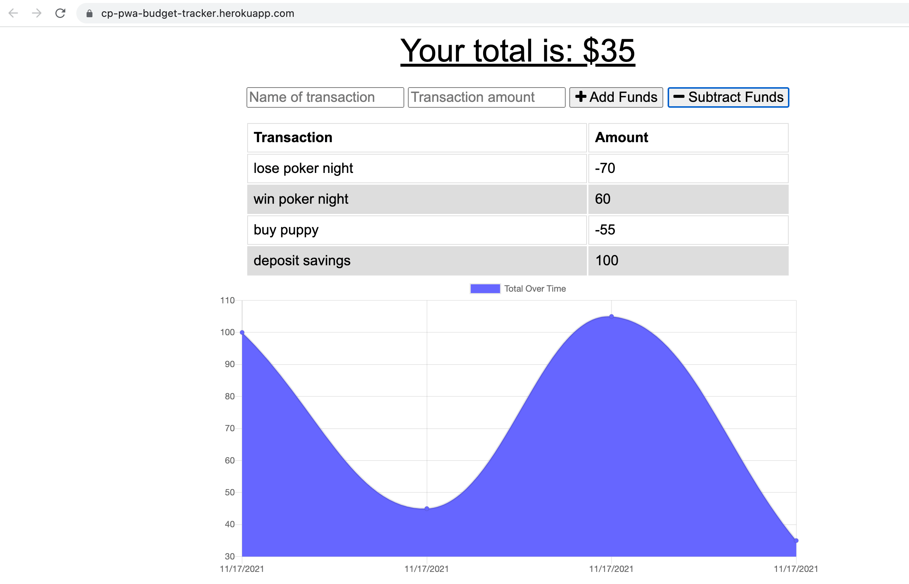

# pwa-budget-tracker

A Progressive Web Application for budget tracking that works online and offline. Uses Node packages and MongoDB backend.

Link to deployed app: <https://cp-pwa-budget-tracker.herokuapp.com/>

This application is a Progressive Web Application (PWA) build using nodejs packages including express, mongoose and compression.  It is deployed to Heroku and will run in offline mode allowing you to add or subtract funds offline. When the application is connected, it will update the MongoDB with the offline transactions.

UserStory:

AS AN avid traveller

I WANT to be able to track my withdrawals and deposits with or without a data/internet connection

SO THAT my account balance is accurate when I am traveling

Note: this application is covered by the  license

## Table of Contents ##

* [Installation](#installation)
* [Usage](#usage)
* [License](#license)
* [Contributing](#contributing)
* [Tests](#tests)¬¬
* [Questions](#questions)

- - -

## Installation ##
Below are brief instructions on how to install:

This is a node.js based application with the dependencies listed in package.json file. To run you can fork the repo and run npm i. You will also need to add a .env file to set up the MONGODB_URI key. The application uses an Atlas MongoDB running in AWS, which you will also need to configure for your instance.

## Usage ##
How to use this application: 

Once installed you can run the app by adding or subtracting funds in the UI. 

## License ##
This application is covered by the following license: 

Creative Commons license family 4.0

## Contributing ##
This project was developed by Chris Pysden as part of the UW Bootcamp Certificate Course for Full Stack Developers. If you would like to contribute to improving this project, then you'd be very welcome. Please follow the following guidelines (which are loosely based on Atom project guidelines):

* send an email to me using the links below to request to be added to the project and improvements briefly describe the improvements you'd like to make
* always create a new branch that encapsulates your changes
* notifiy me before commiting any updates/changes
* track all bugs as issues in the project
* have fun

## Tests ##
Tests included are referenced below:

Test:  

I am working on implementing some basic tests to check validity of the input and to ensure consistency. Currently there are no tests that ship with the code.

## Questions ##

My Github profile is here: <https://github.com/cpysden-coder>

Please contact me with questions at <chris_pysden@mac.com>
